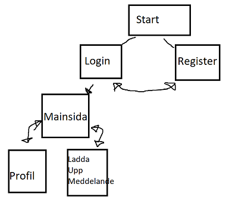

## Inledning

Rasmus Öberg
01/06/2022

## Bakgrund

Detta projekts syfte är att skapa en twitterklon där jag har funktionerna login, register, posta ett meddelande, ta bort meddelande, och ha en profilbild. I detta projekt så lät jag min dator-okunniga flickvän testa sidan och hon tyckte det var svårt att förstå vilken ordning man skulle göra saker på sidan, hon försökte till exempel klicka på profil före hon hade loggat in, dessa saker måste jag fixa.

## Planering
Jag planerade detta projekt genom att rita en skiss på de routes som jag behöver för att få de sidor som jag vill ha. Pappret som jag skissade på är borta men jag gjorde en liknande skiss i paint här.

Jag höll dessutom en logg från session till session om vad jag ska göra nästa lektion och vad jag har gjort idag.

## Positiva Erfarenheter

Jag har lärt mig väldigt mycket om hur man får upp en dynamisk sida och hur man kopplar en databas till den sidan vilket har öppnat många möjligheter till kommande projekt.

## Negativa Erfarenheter

Jag tyckte det var väldigt svårt med mysql kommandon som tex join vilket gjorde så att allt tog väldigt lång tid, inget fel på mysql men jag personligen tyckte det var väldigt svårt att förstå mig på. Jag kan fixa det med att försöka läsa mer om deras dokumentation och hur allt fungerar.

## Sammanfattning

I helhet så har jag lärt mig väldigt mycket av att göra detta projekt, det har lärt mig om routes, databaser, och nunjucks.

